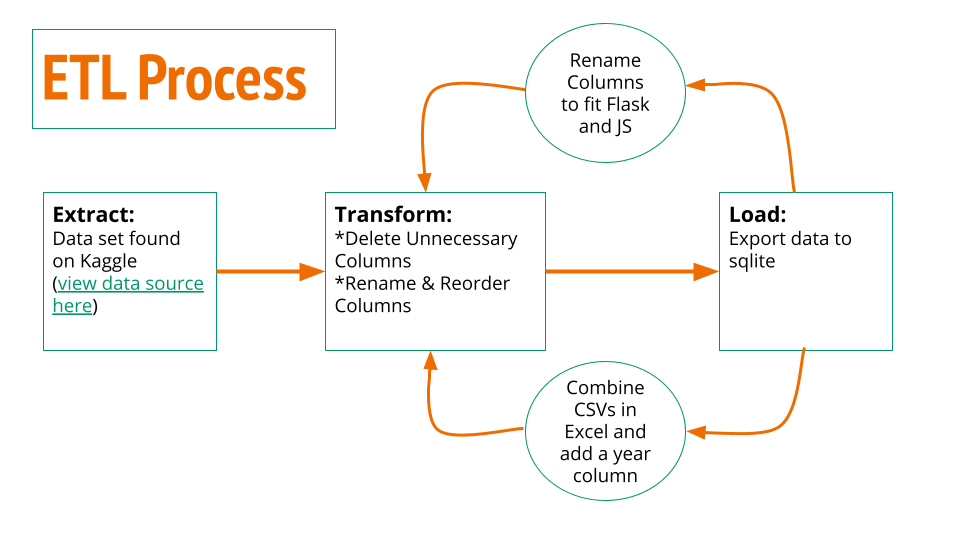
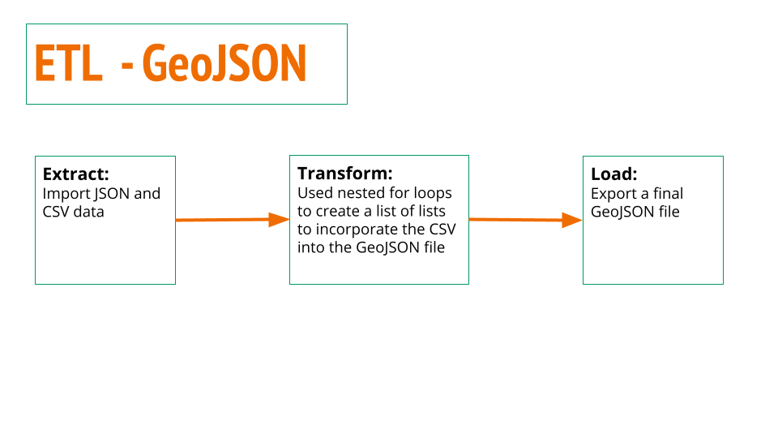
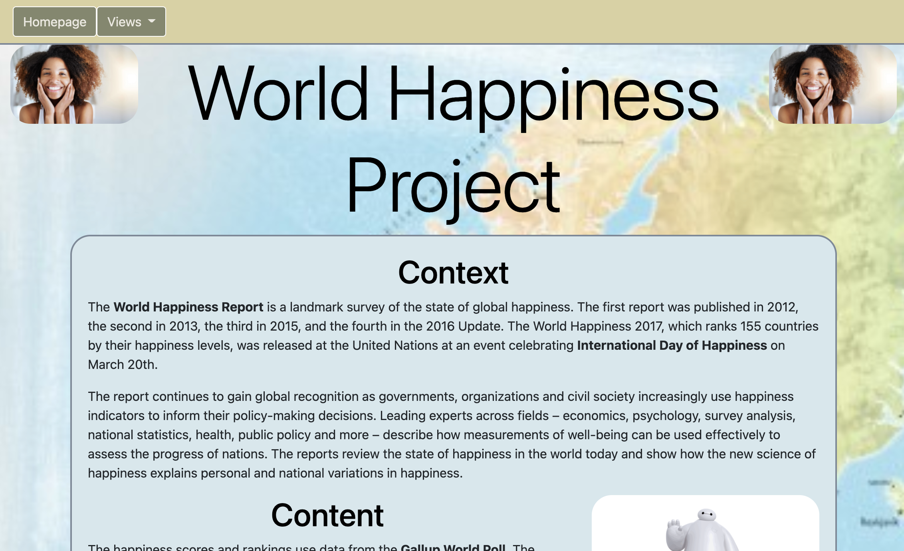
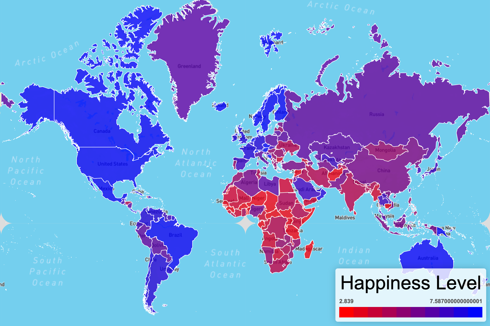
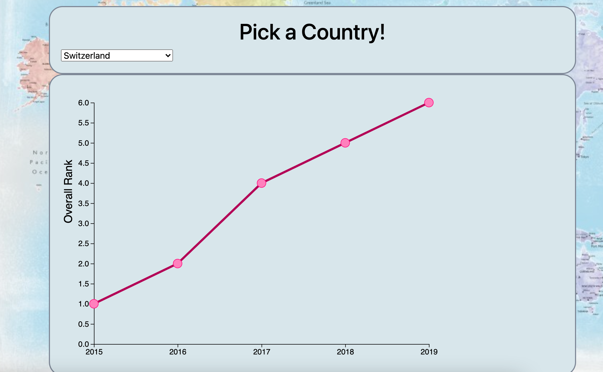
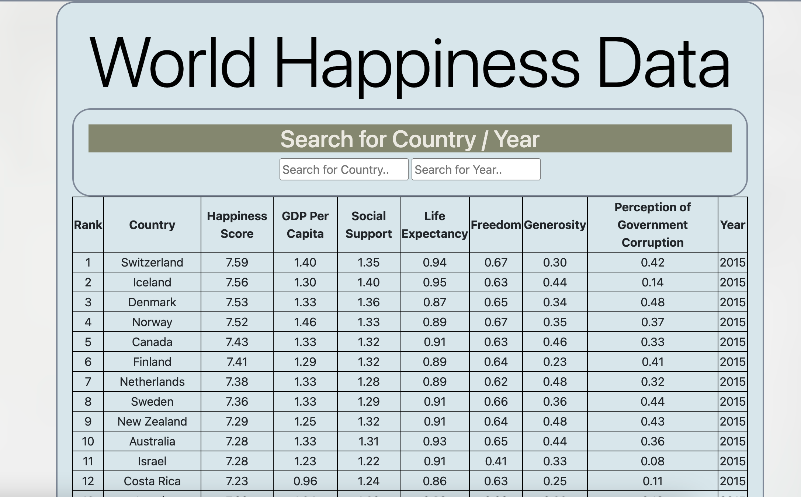
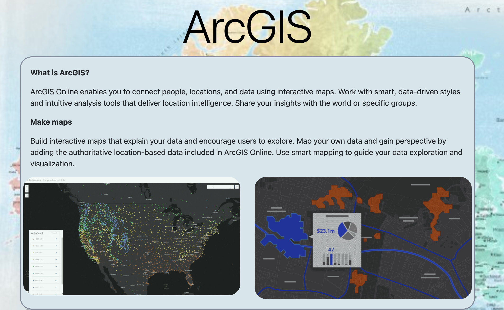

# World-Happiness-Project
Creating and Presenting world happiness Data using JavaScript and other front end resources.

## Overview
In this project, we used a dataset from Kaggle on World Happiness which can be seen [here](https://www.kaggle.com/unsdsn/world-happiness). We created a web app that includes an interactive line chart, an interactive map, the full data, and an ArcGIS example.

### ETL Process
In jupyter notebook, we loaded in the original CSVs [found here](Data). With each CSV, we used python pandas to delete columns that were deemed unecessary, rename and reorder the columns that we wanted to keep in order to normalize each dataset. Finally, we added these dataframes to sql tables and exported them to a sqlite file. 

Additionally, we imported the CSVs and a JSON file in order to combine the two. In jupyter notebook, we used nested for loops to create a list of lists to incorporate the CSV into the GeoJSON file. Finally, we exported this new combined data to a GeoJSON file. 

These items can be viewed in the [cleaning_data_to_sqlite.ipynb](cleaning_data_to_sqlite.ipynb) and [update_json.ipynb](update_json.ipynb) files.

### Flask App
For the Flask App we did the following main items:
* Setup Flask and the sqlite database
* Created a Data page with a connection to the sqlite database
* Created routes for the homepage and visualizations

The code for these items can be viewed in the [app.py](app.py) file.

### HTML & CSS
* We used a javascript library called **anime.js** to create the animations on our pages
* Utilized bootstrap functionalities to create the navbar, and dropdown menu on the Happiness by Country page
* Below shows a preview of each page on our App

#### Visualizations and App Pages
Our final App includes the following pages:
1. **Homepage** 
    Displays the Context, Content, and Inspirations for our Project.
    Code for this page can be viewed in the following files: [index.html](templates/index.html) and [styles.css](static/css/styles.css)
2. **Happiness by Country**  
    An interactive heat map that displays how "Happy" each country is. Within this page, there are 4 additional dropdown items that link to the four additional year's heat maps.
    Code for this page can be viewed in the following files: [logic_2015.js](static/js/logic_2015.js), [happiness_by_country.html](templates/happiness_by_country.html)
3. **Happiness: The Last 5 Years** 
    An interactive line chart with a drop down menu to choose a country and view that Country's Happiness Score over time.
    Code for this page can be viewed in the following files: [yearlyPlot.js](static/js/yearlyPlot.js), [the_last_5_years.html](templates/the_last_5_years.html)
4. **Final Data** 
    A searchable table that displays all of our cleaned data.
    Code for this page can be viewed within the [app.py](app.py) file. 
5. **ArcGIS Example** 
    Displays examples of the ArcGIS maps that we created to display interactive maps of our data.
    Code for this page can be viewed within the [drews_page.html](templates/drews_page.html)

## Conclusions
While we saw some variance over time of how countries ranked, there wasn't any significant movement over this time period. Countries tend to stay around the same rank.

Additionally, while this data and the visualizations provide a great view of a Country's happiness over the past 5 years, it is important to remember the source of the data is a poll and inherently bias.